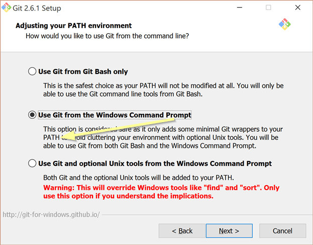

DRAFT

Package manager is a tool for code sharing between developers. Very easy to use, no worries! :wink:

It comes built into [Hexa compiler](https://github.com/hexalang/hexa#download), so you don't have to lurk elsewhere.

Manager works similiar to `npm` (node.js' package manager) where possible.

### Requirements

Package manager works atop of Git. [Download Git installer](https://git-scm.com/downloads) if you don't have
one pre-installed on your system, select add to PATH option:

Packages installed globally into `~/hexa_modules/packages` or `C:\Users\user\hexa_modules\packages`,
thus disk space requirements per-package are not high. Note, that every package version installed into separate
folder like `hexa_modules/packages/.../v1.2.3`, but you may cleanup unused versions.
If packages installed locally on per-project manner, then `./hexa_modules` created in the project root.

### Package bundle

Code with additional data may be bundled into "package" like this:

- `src` - folder with code
- `docs` - folder for docs, if any
- `tests` - folder with tests, if any
- `hexa.json` - list all source files as "src\filename.hexa"
- `.gitattributes` - just add `* text=auto` there to avoid Linux<->Windows<->macOS
[end of lines problems](https://en.wikipedia.org/wiki/Newline#Issues_with_different_newline_formats)
- `.gitignore` - ensure no garbage comes into package
- `README.md` - description and usage examples
- `LICENSE` - any open-source license (prefer MIT or BSD)

Use any of `/` or `\\` slashes. Hexa changes them to platform-specific automagically.

### Registering package versions

git tag

hexa cleanup-patch
hexa --local cleanup-patch
hexa cleanup-minor
hexa cleanup-minor --local
hexa cleanup-major
hexa cleanup-major --local
--no-cache
--reinstall # if broken incomplete download

[Source code of package manager for contributors](TODO\hexa\source\cli\hpm.hexa)

### Uninstalling packages

Do this only if your really need some free disk space. It's okay to have fallbacks if new package version fails.

To uninstall a locally/globally installed package:

$ hexa uninstall <package-name>

"hexaCompiler": "~0.10.0", Specify required Hexa compiler.
Package manager will download older or newer versions **of the package** if possible for your compiler,
until compatible and non-conflicting one is found.

Follow SemVer 2 http://semver.org/
