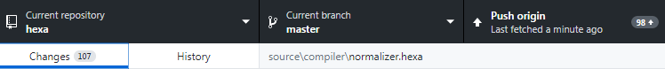
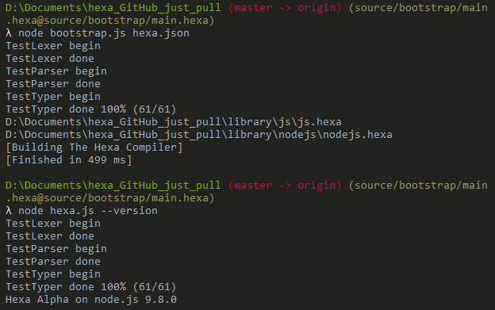

Hello! If you didn't follow, Hexa is a static typed programming language with a touch of style, magic and beauty... oh, I mean, it compiles to JavaScript, soon [haXe](https://haxe.org) and native. Has safety features, looks nice and simple. Coding in Hexa is really calmful and productive :cake:

As I wrote before in [Bootstrap the compiler](Bootstrap-the-compiler.html), large achievement for any language is to "dogfood" a compiler with itself. Same was a goal for Hexa too (intentionaly, to help with future metaprogramming features).

And 100 commits behind... bootstrapping is done! :tada:

From now on, Hexa uses pre-built version of itself to make latest versions usable.

	

There's some quirks, for example, old JavaScript generator dropped entirely from codebase in favor of new normalizer+generator tandem. New generator sometimes breaks compilation, but no worries, it's a quick fix, I just wanted to share my joy as earlier as possible!

It is now really easy to add new <a href="https://github.com/hexalang/hexa/tree/master/source/targets">targets</a> with introduced adaptive code <a href="https://github.com/hexalang/hexa/blob/master/source/compiler/normalizer.hexa">normalizer</a>. It receives platform-specific keywords and rules directly, and does all renaming stuff and heavy lifting by itself.

It's time to backport some features from early prototypes and go public!

